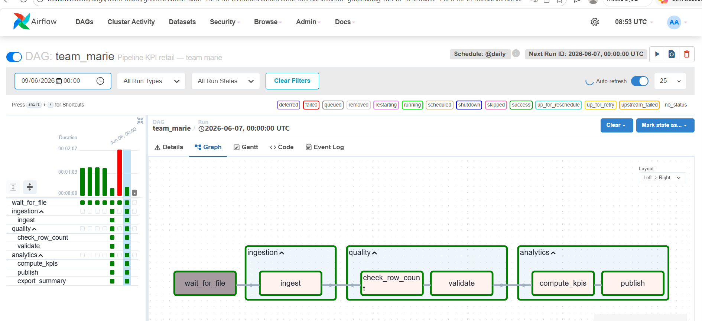
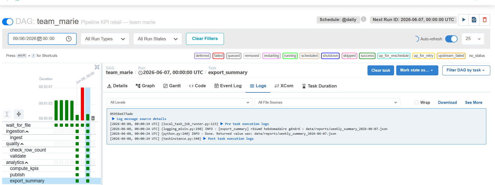
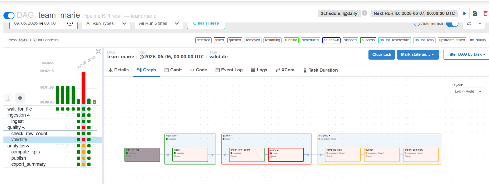
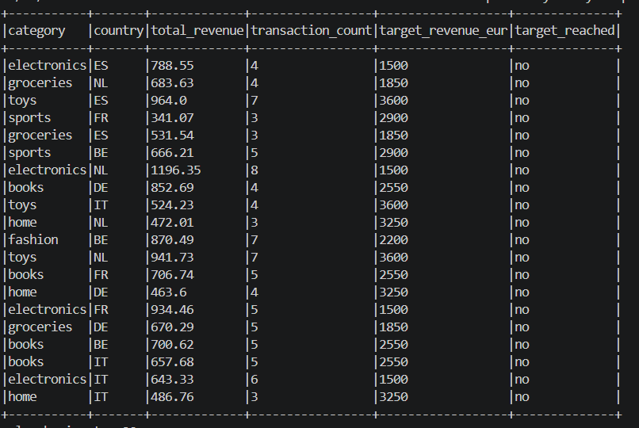

# Team: Marie & Jiro

**DAG id:** `team_marie`  
**Git repo:** `https://github.com/...` - **also on your Moodle slides** (title or architecture)  
**Spark module:** `include/team_marie_spark.py`  
**Course:** Big Data Processing - Lab 4 Capstone

---

## 1. Business problem

A retail partner drops one CSV file per day containing store transactions. Operations needs a daily KPI dashboard showing revenue and transaction counts by category and country. If the pipeline fails, the business has no visibility on daily performance. If corrupt data reaches Spark, KPIs are wrong and decisions are made on bad numbers.

---

## 2. Architecture

| Layer | Path | Tool |
|-------|------|------|
| Bronze | `data/incoming/` | `vendor_drop.py` |
| Silver | `data/raw/dt=` | DuckDB (`ingest_day`) |
| Gold | `data/curated/dt=` | `team_marie_spark.py` |
| Serve | `data/reports/` | JSON dashboard + weekly summary |

### Airflow (7 tasks)

| task_id | Group | Role |
|---------|-------|------|
| `wait_for_file` | - | FileSensor: waits for the daily CSV file from the vendor |
| `ingest` | ingestion | Converts CSV to typed Silver Parquet using DuckDB |
| `check_row_count` | quality | Fails if Silver contains fewer than 10 rows |
| `validate` | quality | Fails if amount_eur sum is 0 (corrupt data detection) |
| `compute_kpis` | analytics | Runs PySpark: read → enrich → aggregate → broadcast join |
| `publish` | analytics | Logs the path of the generated JSON report |
| `export_summary` | analytics | Aggregates last 7 daily reports into a weekly summary JSON |

**Dependency graph:**

wait_for_file → [ingestion] → [quality] → [analytics]
                  ingest       check_row    compute_kpis
                               validate     publish
                                            export_summary

---

## 3. Spark transformations (≥3 - your code)

File: `include/team_marie_spark.py`

| # | Function | What it does |
|---|----------|--------------|
| 1 | `transform_1` | Reads Silver Parquet with strict explicit schema (`SILVER_SCHEMA`). Enforces types at read time to catch schema drift early. |
| 2 | `transform_2` | Filters corrupt rows (`amount_eur <= 0`), adds `revenue_class` column (high/low), adds `logical_date` column. |
| 3 | `transform_3` | Aggregates KPIs by `category` and `country` — computes `total_revenue` and `transaction_count`. Note: `groupBy` triggers a shuffle; acceptable at ~200 rows/day, would require pre-partitioning at scale. |
| 4 | `transform_4` | Broadcast join with `category_targets.csv`. Uses `broadcast()` because reference table is small (~10 rows), avoiding an expensive shuffle. Adds `target_reached` column (yes/no). |

---

## 4. Idempotence

Spark writes Gold Parquet with `mode("overwrite")` — re-running the same `ds` overwrites existing data under `data/curated/dt=<ds>/` without duplicating rows. The JSON report `dashboard_<ds>.json` is also overwritten. Verified by running the same `ds` twice and confirming identical `total_revenue` and `total_transactions`.

---

## 5. Backfill

docker compose exec airflow-scheduler airflow dags backfill team_marie -s 2026-06-01 -e 2026-06-07 --reset-dagruns

Result: 7 runs x 5 tasks = 35 task instances, 0 failures.

---

## 6. Failure demo

python scripts/vendor_drop.py --date 2026-06-06 --corrupt
Then Clear the 2026-06-06 run from Airflow UI

- `validate` fails with: RuntimeError: Validation failed: amount_sum=0.0 (corrupt day?)
- `on_failure_callback` fires: [ALERT] Tâche 'validate' a échoué pour la date 2026-06-06. Vérifier le pipeline immédiatement.
- `compute_kpis` and `publish` are upstream_failed — Spark never runs on corrupt data.

---

## 7. Exploration tracks

| Track | Done? | Describe your implementation |
|-------|-------|------------------------------|
| R Reliability | Yes | `on_failure_callback` logs an alert on any task failure (production-ready for Slack/email). `mode="reschedule"` on FileSensor releases worker slot while waiting. `retries=1` with `retry_delay=2min`. |
| S Spark depth | Yes | Strict schema via `SILVER_SCHEMA` (StructType). `transform_4` uses `broadcast()` for join with reference file. Shuffle note documented in `transform_3`. |
| O Orchestration | Yes | Tasks organized into 3 `@task_group`s: `ingestion`, `quality`, `analytics`. Improves UI readability and makes it clear which pipeline phase failed. |
| Q Data quality | Yes | `check_row_count` task raises `ValueError` if Silver contains fewer than 10 rows. Detects partially delivered files before launching Spark. |
| P Custom | Yes | `export_summary` task aggregates the last 7 daily JSON reports into a weekly summary. Result stored in XCom, visible from Airflow UI. |
| X SparkSubmit | No | Not implemented — local[*] mode sufficient for laptop environment. |

---

## 8. Demo script & backup

**Live demo (~5 min):**
1. Show DAG graph with 3 TaskGroups — explain each group's role
2. Show a green run for 2026-06-05 — all 7 tasks success
3. Open export_summary → XCom tab — show weekly summary data
4. Run vendor_drop --corrupt for 2026-06-06 — show validate red, callback alert in logs
5. Explain idempotence: re-run same ds, show identical JSON output

**Backup screenshots to prepare:**
- Airflow graph with all green tasks (TaskGroups visible)
- validate task red after --corrupt
- on_failure_callback alert in logs
- export_summary XCom content
- dashboard_<ds>.json content
- weekly_summary_<ds>.json content

---

## 9. Production next steps

- Replace `on_failure_callback` print with real Slack/email API call
- Replace `local[*]` SparkSession with `SparkSubmitOperator` pointing to a real cluster
- Make `check_row_count` threshold dynamic (based on historical average)
- Add SLA on `wait_for_file` sensor to alert if vendor is late
